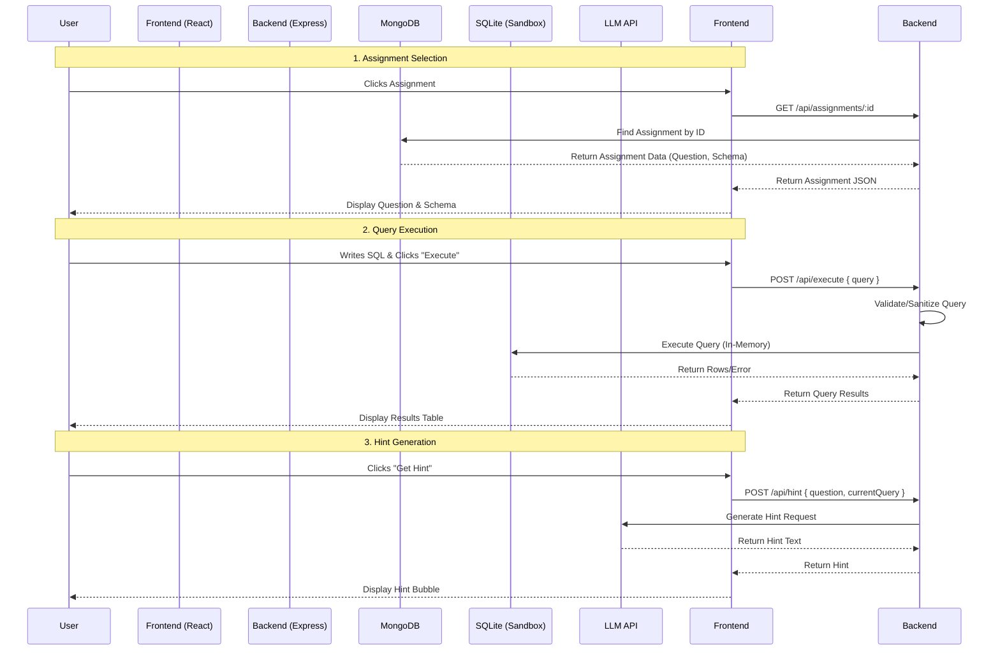

# CipherSQLStudio

A browser-based SQL learning platform where students can practice SQL queries against pre-configured assignments with real-time execution and intelligent hints.

## Features
- **Assignment Listing**: View available SQL challenges.
- **SQL Playground**: Interactive Monaco Editor.
- **Real-time Execution**: Run queries against a live in-memory SQLite sandbox.
- **Intelligent Hints**: Get help from an integrated LLM.

## Tech Stack
- **Frontend**: React, Vite, SCSS (Mobile-first)
- **Backend**: Node.js, Express
- **Database**: 
  - **MongoDB**: Stores assignments metadata (questions, schema definitions).
  - **SQLite**: In-memory sandbox for executing user SQL queries safely.

## Data-Flow Diagram



## Setup Instructions

### Prerequisites
- [Node.js](https://nodejs.org/) (v16+)
- [MongoDB](https://www.mongodb.com/) (Running locally or Atlas URI)

### 1. Backend Setup (Server)

1. Navigate to the server directory:
   ```bash
   cd server
   ```

2. Install dependencies:
   ```bash
   npm install
   ```

3. Configure Environment Variables:
   Create a `.env` file in the `server` directory with the following keys:
   ```env
   PORT=5000
   MONGO_URI=mongodb://localhost:27017/cipher_sql_studio
   LLM_API_KEY=your_gemini_api_key_here
   ```

4. Seed the Database:
   Populate MongoDB with initial assignments:
   ```bash
   npm run start # The server includes a seed script check or run manually if separate
   # Or directly:
   node src/seed.js
   ```

5. Start the Server:
   ```bash
   npm start
   # Or for development with nodemon:
   npm run dev
   ```
   Server will run on `http://localhost:5000`.

### 2. Frontend Setup (Client)

1. Navigate to the client directory:
   ```bash
   cd client
   ```

2. Install dependencies:
   ```bash
   npm install
   ```

3. Configure Environment Variables:
   Create a `.env` file in the `client` directory:
   ```env
   VITE_API_BASE_URL=http://localhost:5000
   ```

4. Start the Development Server:
   ```bash
   npm run dev
   ```
   Client will run on `http://localhost:5173`.

## Running the Full Application
For convenience, you can run both services quickly:

**Windows**:  
Run the `start.bat` file in the root directory to launch both client and server automatically.

## API Documentation

### Endpoints
- `GET /api/assignments`: List all assignments.
- `GET /api/assignments/:id`: Get details for a specific assignment.
- `POST /api/execute`: Execute a SQL query.
  - Body: `{ query: "SELECT * FROM ...", schemaName: "..." }`
- `POST /api/hint`: Generate a hint.
  - Body: `{ question: "...", currentQuery: "..." }`
